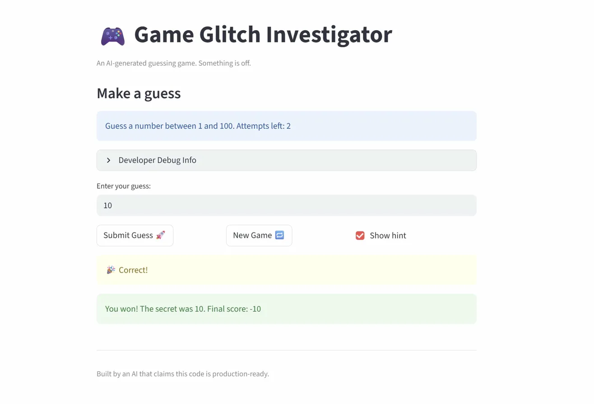
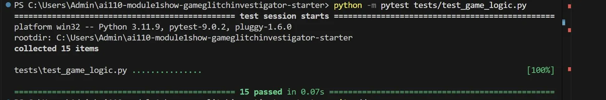

# 🎮 Game Glitch Investigator: The Impossible Guesser

## 🚨 The Situation

You asked an AI to build a simple "Number Guessing Game" using Streamlit.
It wrote the code, ran away, and now the game is unplayable.

- You can't win.
- The hints lie to you.
- The secret number seems to have commitment issues.

## 🛠️ Setup

1. Install dependencies: `pip install -r requirements.txt`
2. Run the fixed app: `python -m streamlit run app.py`

## 🕵️‍♂️ Your Mission

1. **Play the game.** Open the "Developer Debug Info" tab to see the secret number.
2. **Find the State Bug.** Why does the secret number change every time you click 
   "Submit"? Ask ChatGPT: *"How do I keep a variable from resetting in Streamlit 
   when I click a button?"*
3. **Fix the Logic.** The hints ("Higher/Lower") are wrong. Fix them.
4. **Refactor and Test.** Move the logic into `logic_utils.py` and run `pytest`.

## 🐛 Bugs Found and Fixed

1. **Hint logic broken on even attempts**
   The secret number was converted to a string on every even attempt, causing 
   Python to use lexicographical comparison instead of numeric. This made hints 
   point the player in the wrong direction.
   Fix: removed the str() conversion — check_guess now always receives integers.

2. **Hint messages were swapped**
   "Too High" told the player to go higher and "Too Low" told them to go lower —
   the complete opposite of what they should say.
   Fix: swapped the emoji and direction text in check_guess in logic_utils.py.

3. **Attempt counter started at 1 instead of 0**
   The player silently lost one attempt before making any guess because 
   session_state.attempts was initialized to 1.
   Fix: changed the initial value to 0.

4. **New Game ignored difficulty setting**
   Clicking New Game always generated a secret between 1 and 100 regardless of 
   the selected difficulty.
   Fix: New Game now uses low and high from get_range_for_difficulty.

## 📝 Document Your Experience

The game is a number guessing game built with Streamlit where the player tries 
to guess a randomly generated secret number within a limited number of attempts. 
The game gives hints after each guess to guide the player closer to the answer. 
This version was intentionally shipped with several logic bugs to practice 
AI-assisted debugging, code refactoring, and pytest testing.

All core logic was moved from app.py into logic_utils.py and covered with 15 
automated pytest tests.

## 📸 Demo

## 🚀 Stretch Features

- [ ] High Score tracker
- [ ] Guess History sidebar
- [ ] Color-coded hints